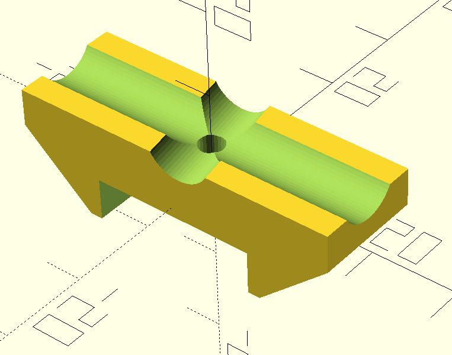

# Yagi Antenna Element Mounting Clip  
Parametric OpenSCAD clip for securing antenna elements to a boom tube

  

## Features
- **Parametric Design**: Customizable dimensions for various boom tubes, element sizes, and hardware
- **Integrated Parking Slot**: Secondary slot to store unused elements at an adjustable angle
- **Chamfered Edges**: Enhanced structural integrity with streamlined edges
- **Mounting Screw**: Centered bore for secure boom tube attachment

## Parameters
Adjust these variables in the `.scad` file:

| Parameter         | Description                           | Default |
|-------------------|---------------------------------------|---------|
| `mounting_width`  | Total width of the clip (mm)          | 12      |
| `boom_width`      | Boom tube diameter (mm)               | 19      |
| `element_dia`     | Antenna element diameter (mm)         | 8       |
| `element_gap`     | Clearance below elements (mm)         | 5       |
| `mounting_screw`  | Screw diameter (mm)                   | 3       |
| `parking_angle`   | Storage slot angle (degrees)          | 10      |
| `$fa`             | Fragment angle size                   | 1       |
| `$fs`             | Fragment size in mm                   | 0.4     |

## Usage
1. Install [OpenSCAD](https://openscad.org/)
2. Adjust parameters in the script
3. Render the model (F6)
4. Export as STL (File > Export > Export as STL)
5. 3D print using rigid filament

## Design Notes
- **Main Element Slot**: Horizontally centered cylindrical cutout
- **Parking Slot**: Angled secondary cutout for element storage
- **Screw Hole**: Vertical bore through center for boom attachment
- **Symmetry**: Mirror operation creates identical chamfers

## Printing Recommendations
- **Materials**: PETG, ABS, or ASA for outdoor durability
- **Infill**: ≥40% with 4+ perimeters
- **Orientation**: Print with flat side down (Z-axis parallel to screw hole)

## Customization Examples
```openscad
// Slim boom profile
boom_width = 15;
element_dia = 6;

// Thick elements with storage slot
element_dia = 10;
parking_angle = 15;

// M4 hardware setup
mounting_screw = 4;
mounting_width = 14;
